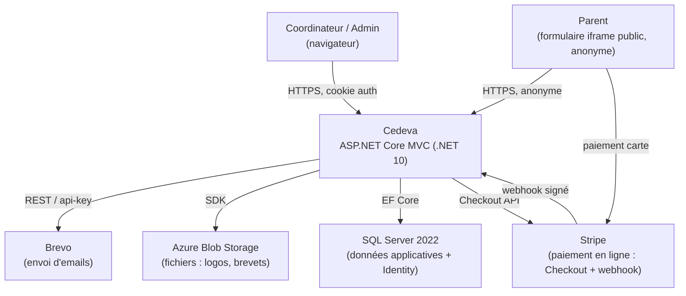
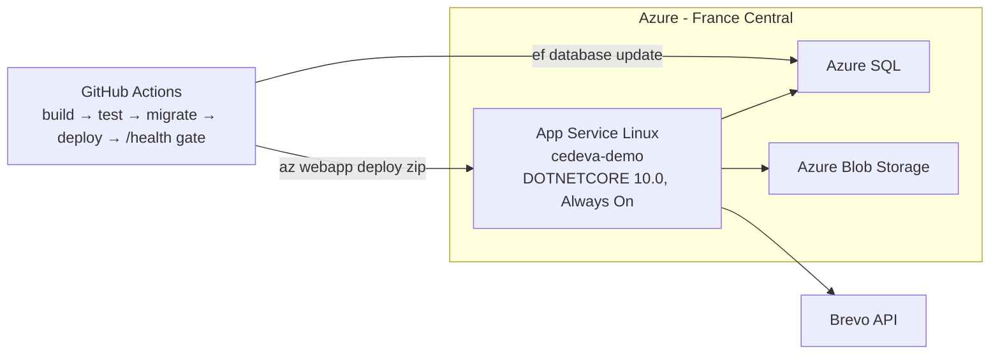
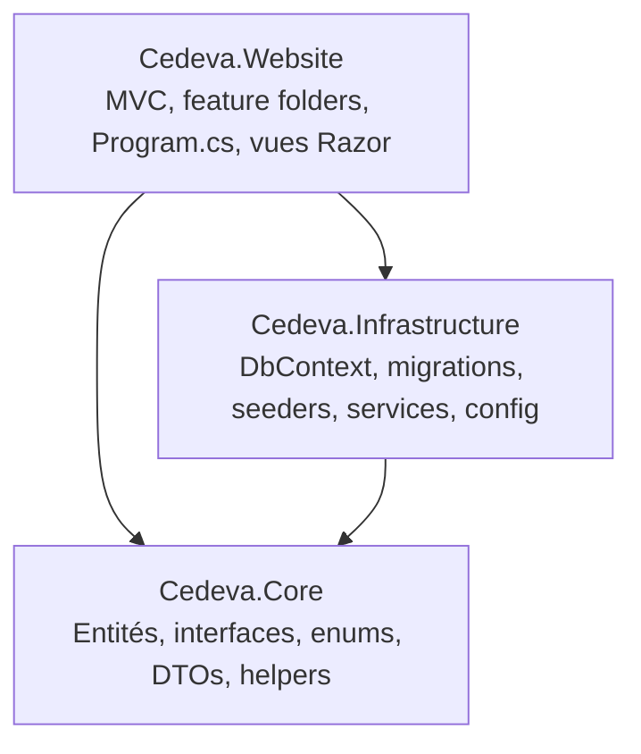
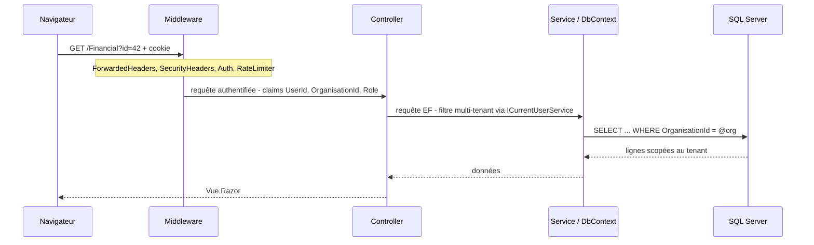

# Architecture de Cedeva

Cedeva est une application **SaaS multi-tenant** de gestion de centres de vacances pour enfants
(Belgique) : activités, inscriptions d'enfants, équipes d'animation, communications parents,
suivi financier, excursions. Document organisé selon le modèle **C4** (contexte → conteneurs →
composants).

## 1. Contexte (qui interagit avec le système)

Deux profils d'accès : l'**application authentifiée** (coordinateurs/admin, cookie ASP.NET
Identity, rôles `Admin` / `Coordinator`) et le **formulaire d'inscription public** embarquable en
iframe sur des sites partenaires (anonyme).

## 2. Conteneurs / déploiement

CI/CD : un workflow GitHub Actions ([main_cedeva-demo.yml](../.github/workflows/main_cedeva-demo.yml))
qui, sur push `main` : build .NET 10 → `dotnet test` (gate) → migrations EF → déploiement zip →
**vérification `/health`** (un déploiement n'est validé que si l'app répond réellement). Voir
[ADR 0007](adr/0007-cicd-azure-app-service-with-health-gate.md).

## 3. Structure interne (composants)

Solution en 3 projets (Clean Architecture light) :

| Projet | Responsabilité |
|--------|----------------|
| **Cedeva.Website** | Présentation MVC. Un dossier par fonctionnalité (`Features/{X}/` = controller + vues + ViewModels). `Program.cs` (pipeline + DI). Localisation FR/NL/EN. |
| **Cedeva.Core** | Domaine pur : entités (`AuditableEntity` de base), interfaces de services, enums, DTOs, helpers. Aucune dépendance d'infrastructure. |
| **Cedeva.Infrastructure** | `CedevaDbContext` (EF Core), migrations, seeders, implémentations de services (Email/Brevo, Financial, Excursion, Paiement/Stripe, Storage, Excel/PDF…), `Configuration/` (Options). |

### Flux d'une requête authentifiée

## 4. Patterns transverses

- **Multi-tenancy** : filtres de requête globaux EF Core sur `OrganisationId` (`Activity`, `Parent`,
  `Child`, `TeamMember`, `CodaFile`, `BankTransaction`, `EmailTemplate`). L'admin contourne ;
  `IgnoreQueryFilters()` pour les cas explicites. Voir [ADR 0003](adr/0003-multi-tenancy-via-ef-global-query-filters.md).
- **Repository + Unit of Work** génériques (`IRepository<T>`, `IUnitOfWork`) coexistant avec un
  accès direct au `DbContext` dans certains controllers. Voir [ADR 0005](adr/0005-repository-and-direct-dbcontext.md).
- **Audit automatique** : `AuditableEntity` (CreatedAt/By, ModifiedAt/By) renseigné dans l'override
  `SaveChangesAsync` du `DbContext`.
- **DI** : Autofac (`ConfigureContainer`), enregistrements dans `Program.cs`. Voir [ADR 0004](adr/0004-autofac-dependency-injection.md).
- **Configuration typée** : pattern Options (`BrevoOptions`, `AzureStorageOptions`).
- **Localisation** : `IStringLocalizer<SharedResources>`, cookie FR/NL/EN.

## 5. Stack technique

| Élément | Choix |
|---------|-------|
| Runtime | .NET 10 ([ADR 0006](adr/0006-upgrade-to-net-10.md)) |
| Web | ASP.NET Core MVC (Razor, feature folders) |
| Données | EF Core + SQL Server 2022 |
| Auth | ASP.NET Core Identity (cookie, rôles) ([ADR 0008](adr/0008-cookie-identity-and-security-hardening.md)) |
| DI | Autofac |
| Email | Brevo (HTTP, `IHttpClientFactory`) |
| Paiement | Stripe Checkout derrière `IPaymentGateway` ([ADR 0010](adr/0010-online-payments-provider-agnostic-stripe.md)) |
| Fichiers | Azure Blob (prod) / disque local (dev) |
| Export | ClosedXML (Excel), QuestPDF (PDF) |
| Logs | Serilog (console + Seq optionnel, enrichers) |
| Tests | xUnit + FluentAssertions + NSubstitute ; SQLite, Testcontainers (SQL Server), Playwright (E2E) ([ADR 0011](adr/0011-test-layers-e2e-and-db-fidelity.md)) |
| CI/CD | GitHub Actions → Azure App Service (+ workflows E2E et SQL dédiés) |

## 6. Voir aussi
- [Exigences non-fonctionnelles](non-functional-requirements.md)
- [Stratégie de test](test-strategy.md)
- [Décisions d'architecture (ADR)](adr/)
