# CEDEVA 2.0

Page d’entrée la plus simple possible, on ne garde que les stages.

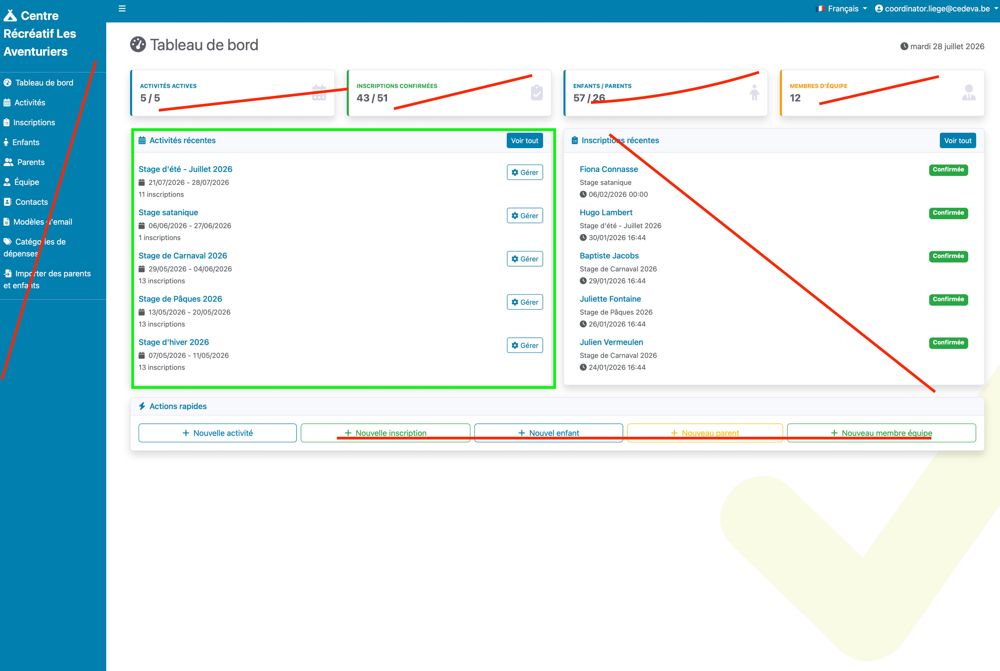

Quand on clique sur un stage, on devrait arriver ici ⬇️

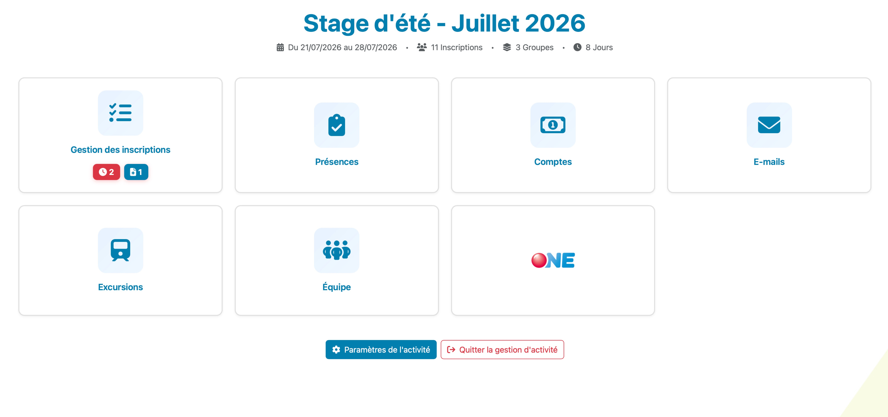

# Confirmation des inscriptions

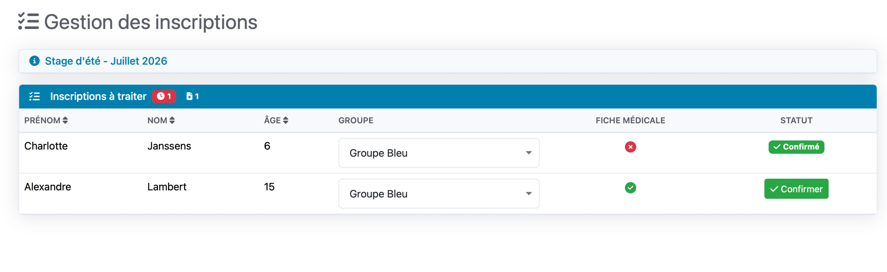

Ici, on n’affiche que les “A CONFIRMER”. Quand on clique sur le bouton ou sur le nom de l’enfant ou toute la igne, on voit ce qu’il a choisi, le coordinateur indique le montant à payer et un mail part vers le parent avec tout ça, et un lien de paiement

Exemple ⬇️ Le coordinateur encore le montant dans la case entourée en rouge et valide

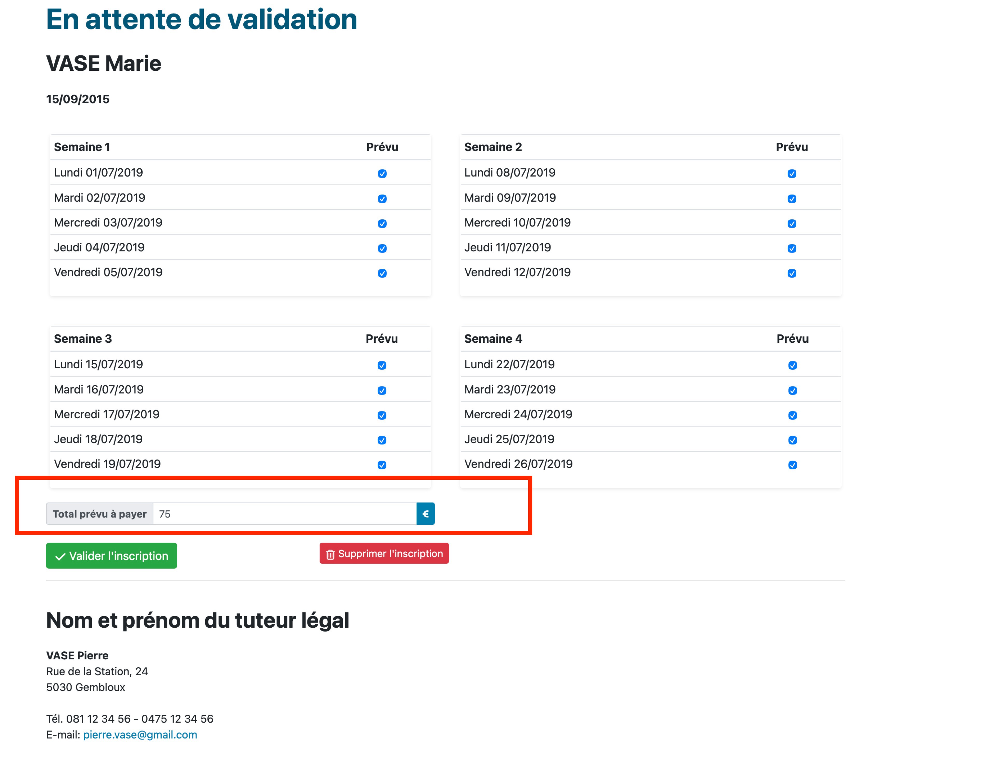

# Présences

⬆️ Quand on clique sur un enfant, il ne se passe rien.
Peux-tu arriver sur une page avec ses inscriptions pour ce stage?

Un genre de ⬇️

Avec la possibilité de corriger l’adresse, le parent, le groupe, la réception de la fiche médicale, listing des paiements éventuellement…

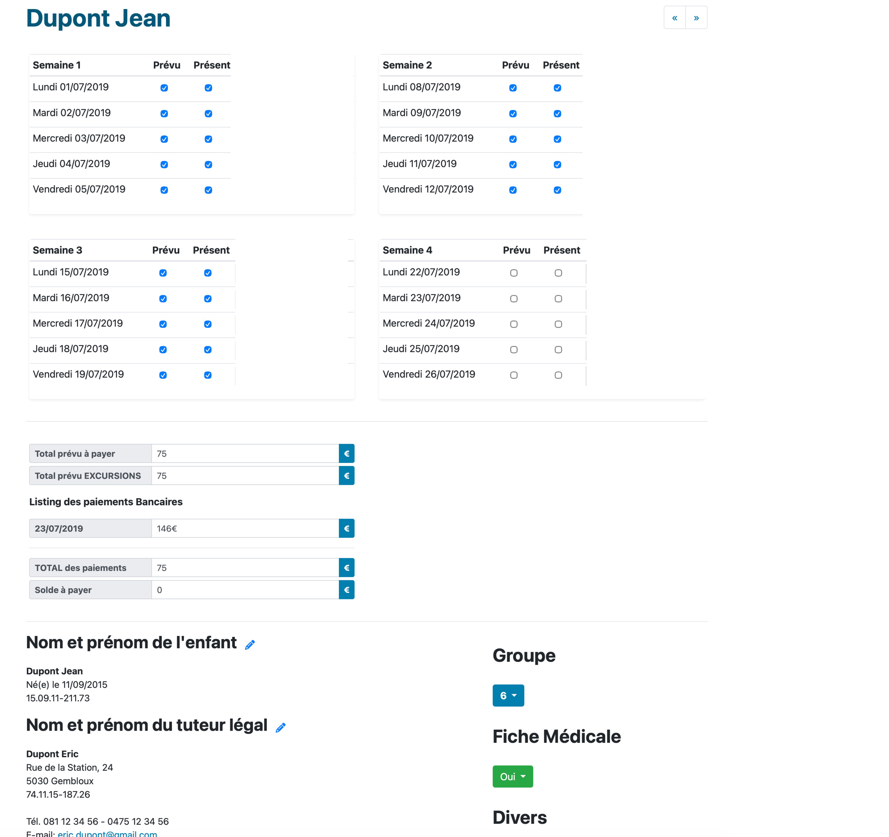

## Menu Hamburger

Tout ça, je le sortirai de là pour le mettre uniquement en page d’accueil, là où il y a les premiers stages.

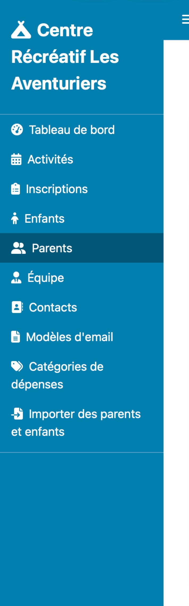

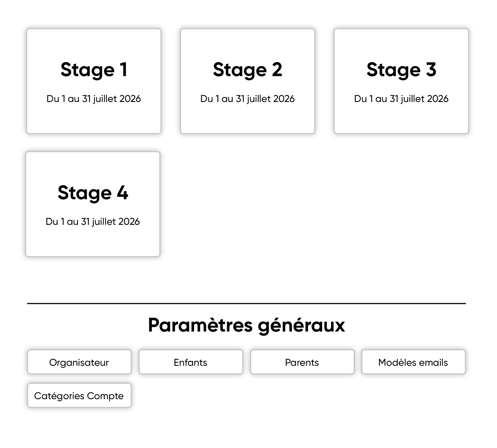

## Qu’en penses-tu???

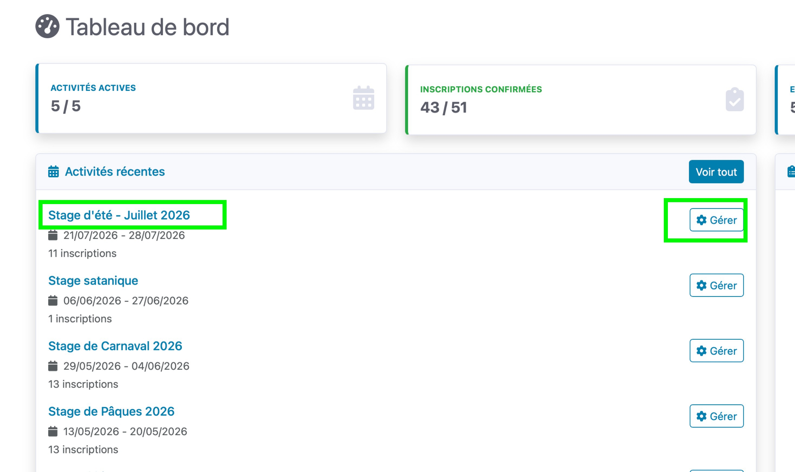

Pour le tableau de Bord, en plus des gros bouton, la logique est inversée à mon sens.
Quand on clique sur le titre, on doit arriver sur les 7 gros boutons (Inscriptions, présences, Comptes, E-mails, Excursions, Equipe et ONE).
Par contre, quand on clique sur Gérer, on peut arriver dans les “Paramètres de l’activité”. D’ailleurs, je noterai “Paramètres” plutôt que gérer pour que ça soit clair.

## Page présence

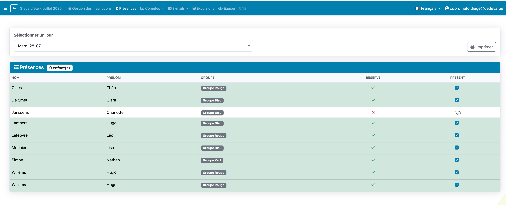

Elle est tout simple, ça me semble OK.

Vérifier que le jour affiché là (qui par défaut est “aujourd’hui”), affiche la liste des enfants inscrit à cette activité. 

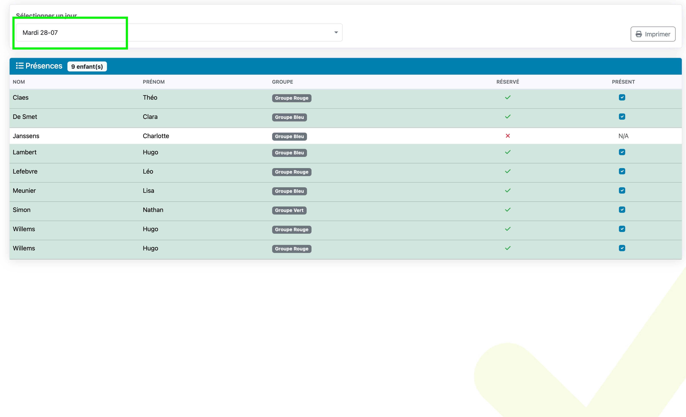

Il faut qu’on discute en cas de non-paiement et voir si le coordinateur peut forcer une inscription et encoder un paiement à la main. Il y a des parents qui paient en plusieurs fois, d’autres qui font payer par le CPAS ou une “facture…” donc après…

On peut rajouter une colonne “Payé” avec un V vert ou une X rouge (et le oslde) si ce n’est pas payé à 100%.

Pour le menu du haut, je supprimerai tout pour ne noter que “Tableau de bord” et revenir aux 7 gros bouton.
Par contre, dans le menu, on peut intégrer des pages spéciales:

- liste des groupes que l’on peut imprimer facilement (filtres par groupe et par jours
    
    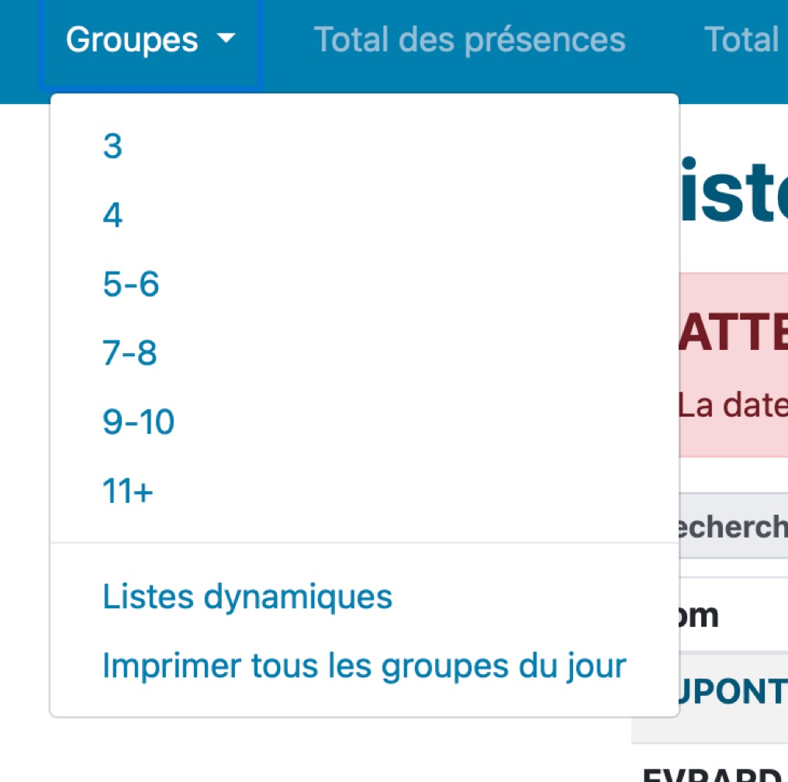
    
    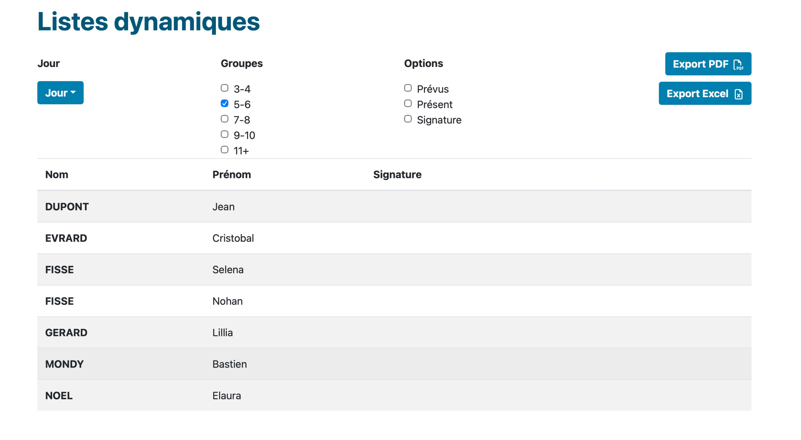
    
- Total des présences journalières
    
    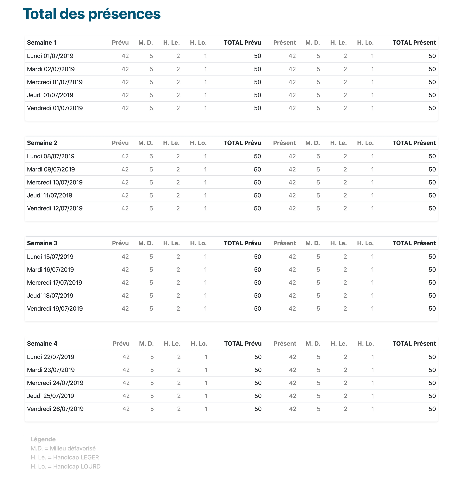
    

# Comptes

Là aussi, simplification au maximum.

Quand on clique sur COMPTE, on arrive sur la liste des transactions. On peut masquer les infos.

Juste la liste.

Au niveau du détail, ça peut juste être la catégorie. Rien de plus.

Par contre, pour chaque ligne, il nous fait un ID unqiue “Numéro de ticket” qui permet de classer les vrais tickets papier dans une farde avce un numérotation qui correspond à ce qui est encodé.

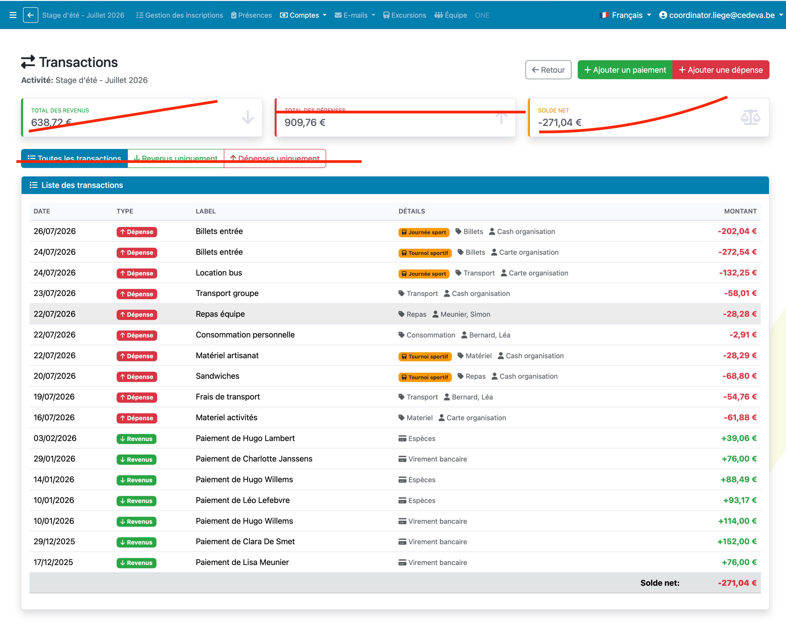

Il faudra que tu m’expliques le fonctionnement des + Ajouter un paiement et + Ajouter une dépense.

Pour moi qu’on ajoute un paiement ou une dépense doit être le même écran.

## Catégories

⬆️ Pour notre fonctionnement, je vois 2 grands types de catégories:

- Celles “Entrées” qui sont normalement en positif : PAF des parents, subsides, Garderies,… Tout ce qui “rapporte de l’argent”
- Celles “Sorties” c’est à dire celle où normalement, on dépense/perd de l’rgent : matériel, assurances, banque, collation,…

Donc, quand on crée les catégorie, on peut garder ce fonctionnement + rajouter le budget.

Au final, les comptes dans le BILAN, sont présentés en 2 grandes catégories:

- Entrées
- Sorties
- Et on a même créé un “Hors bilan” qui est par exemple un transfert de compte du compte à vue au compte épargne. Ca crée une ligne dans les comptes, mais ça n’impacte pas le bilan.

Et dans celles là, on retrouve les sous-catégories indiquées juste avant.

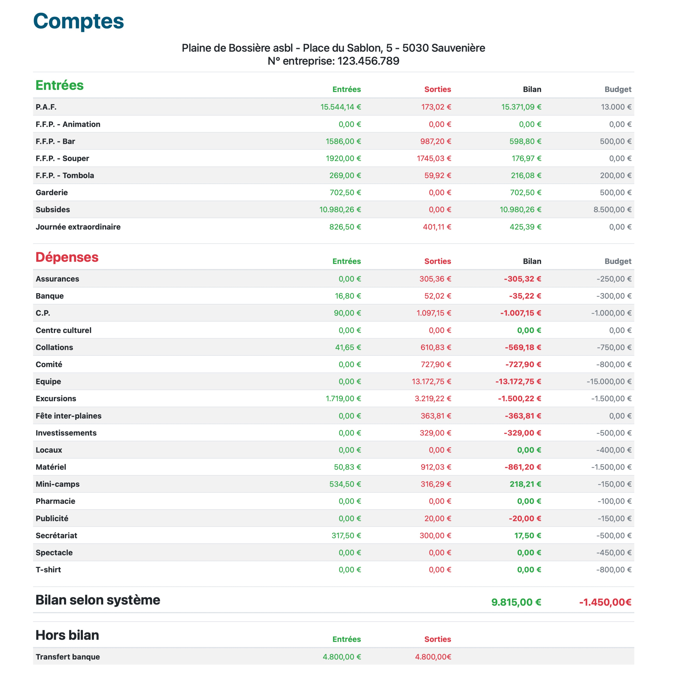

Quand on clique sur une sous-catégorie, on retrouve la liste des tickets lié à cette catégorie.

Exemple ⬇️ J’ai cliqué sur “FFP - Repas”, j’ai alors accès à la liste des entrées et sorties FFP-Repas. 

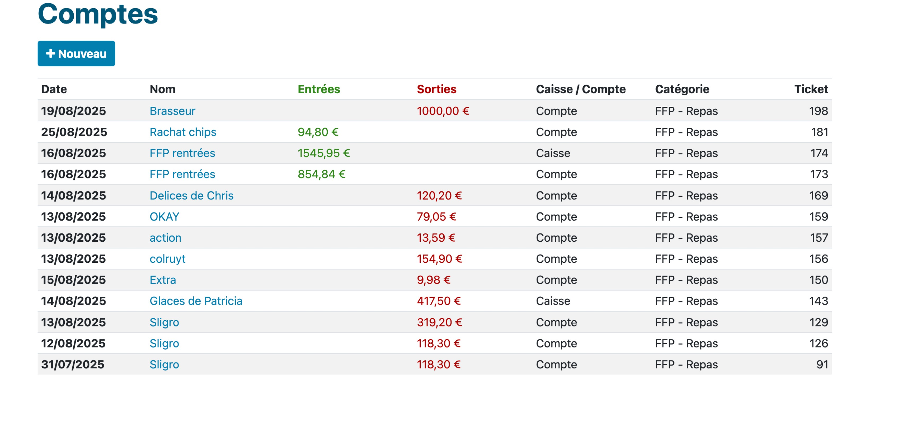

⬇️ la partie Salaire de l’équipe peut sortir de là pour retourner dans l’onglet équipe. Ca peut-être une catégorie “Sorties” qui peut s’appeler Equipe et qui est là d’office. Et qui se complète automatiquement au fur et à mesure de l’avancement du tableau équipe.
Tout comme les PAF, c’est une catégorie Enntrée qu ipeut être là et qui se calcule toute seule puisqu’on a les infos par ailleurs.

## Le rapport

Tel qu’il est affiché là, il n’est pas très lisble. Je préfère la vue en Entrées / Sorties comme ici plus haut.

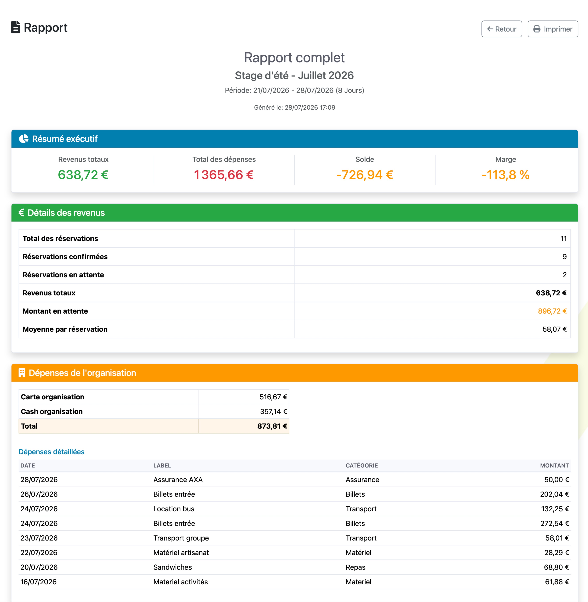

# E-mails

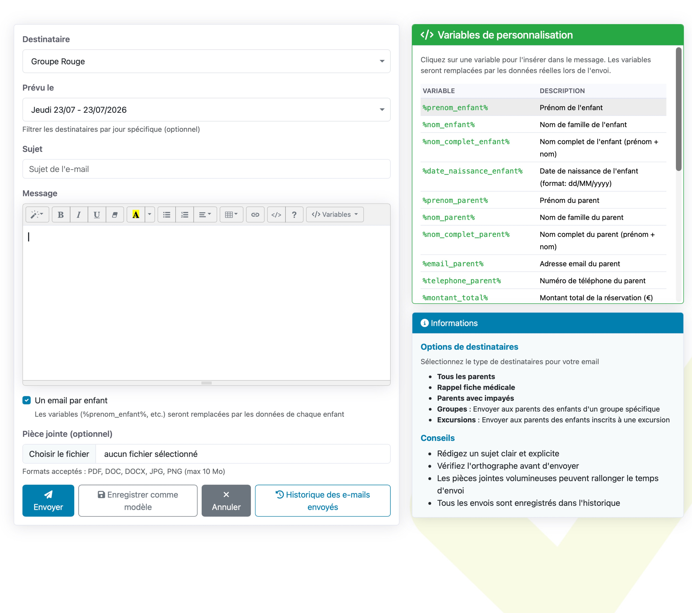

Franchement, la fonction est TOP !

A voir comment on épure un peu cette page. Peut-être comme ça?

## Modèles

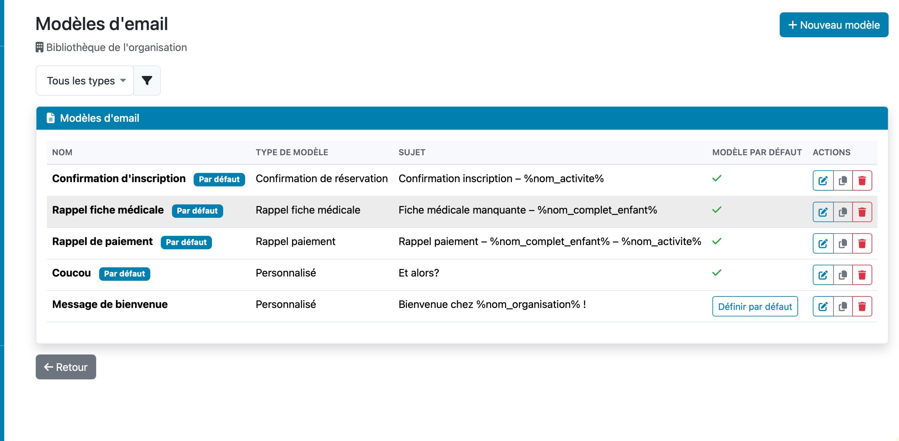

Je garderai les modèles :

- Confirmation d’inscription
- rappel fiche médicale
- Rappel paiement

Ces 3 là, on peut les modifier mais on ne peut pas les remplacer ou en créer un nouveau. Je vois que quand l’on crée un nouveau modèle, on peut faire un Confirmation de réservation. J’ai peut des doublons inutiles.

Par contre, si quelqu’un veut faire un modèle Excursion en fait ce qu’il veut.

Pour moi, les modèles généraux peuvent se retrouver dans toutes les activités. Pas besoin de modèles par activités.

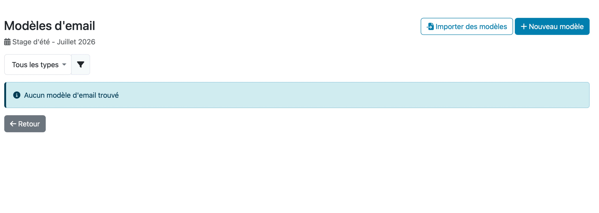

Et alors, je ne sais pas comment envoyer un mail à partir d’un modèle; je n’ai pas trouvé… 

# Excursions

Dans gérer les excursions, on peut ne garder que le minimal minimal : Titre, date et groupe.

Ne l’efface pas à tout jamais, on va introduire ça 

Ce qui serait bien, c’est que quand une activité est programmée, le système nous propose d’envoyer un email “excursion”. On pourrait imaginer un modèle de mail pour ça. Que le coordinateur peut modifier mais déjà avec la date, le lieu, le montant,… et un lien de paiement personnalisé…

# Equipe

Cette vue, c’est TB. Mais je me demande comment pourrait-on l’alléger.

C’est bien de retrouver l’historique aussi…

En mettant en dessous ?

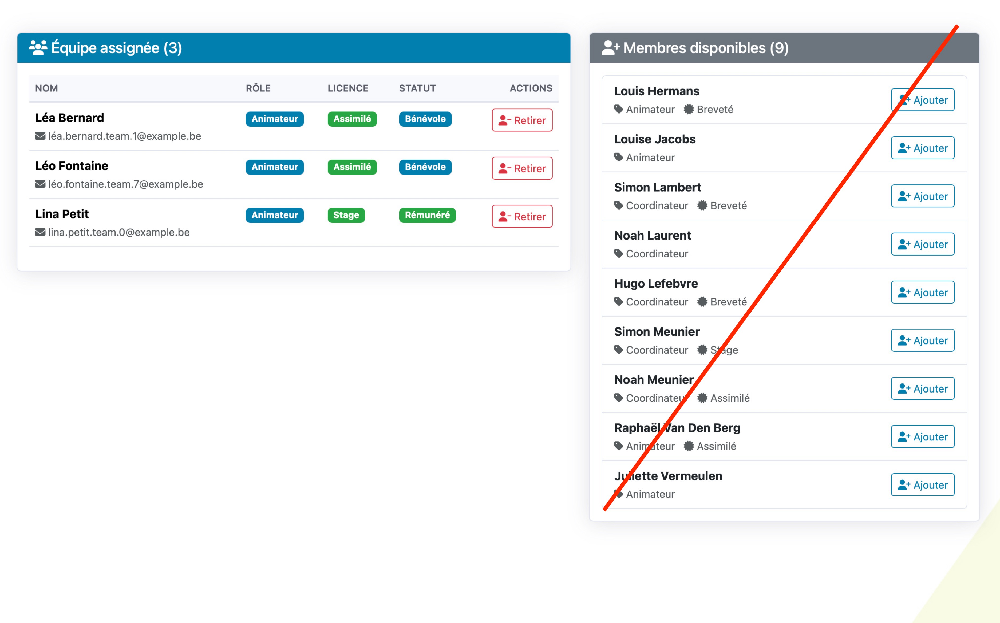

## Présence de l’équipe

Comme pour les enfants, on doit prévoir des présences de l’équipe au jour le jour, que le coordinateur doit cocher.

Exemple ci-dessous

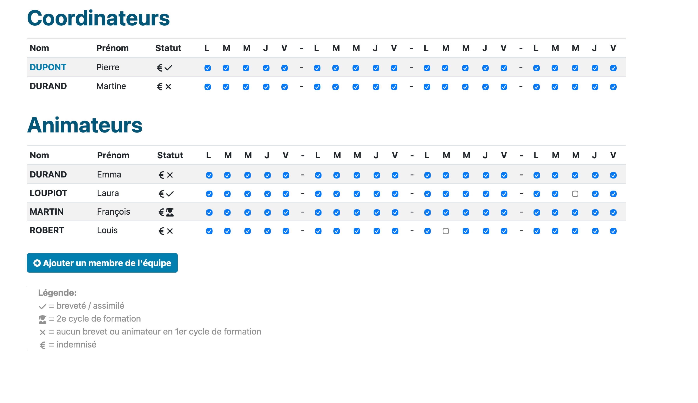

Pour chacun, en cliquant sur son nom, on arrive dans le détail qu’on peut modifier.

Mais surtout, dans le bas, on a les complémentes / dépenses qu’on peut lui payer ou qu’il doit nous payer :

- formation
- sandwich
- prime
- …

On peut même mettre là son extrait de casier judiciaire

Et quelque part, on affiche le décompte pour tout le monde : le total à payer par personne. Pour celui qui fait les paiements, tout est rassemblé là.

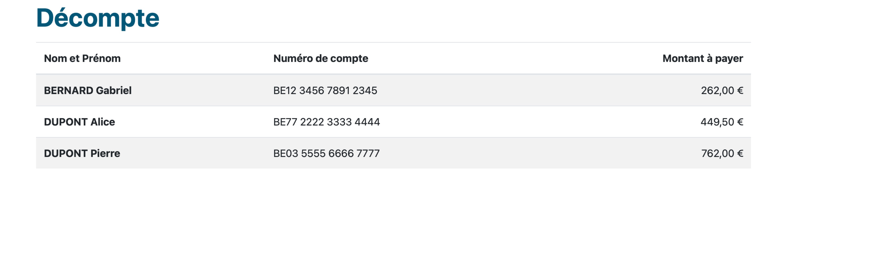

# ONE

- Par activité, on doit avoir 4 tableaux avec des infos précises:
    - Nombre d’enfants présents par jour de - de 6 ans
    - Nombre d’enfants présents par jour de + 6 ans à
    - Listing des enfants de - de 6 ans (N°, nom, prénom, age, date jour 1, date dernier jour, nombre de jour, prix payé, milieu défavorisé, handicap léger, handicap lourd)
    - Listing des enfants de + de 6 ans

<aside>
📁

**Exemple**

---

[Listing ONE.pdf](17.pdf)

</aside>

- Attestations fiscales
    - Can, idéalement, ce n’est pas par activité mais regroupé par association. On en discute.