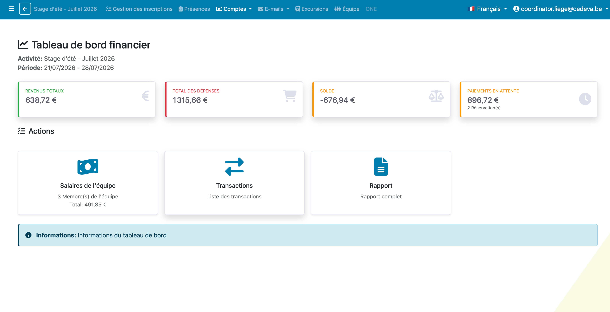
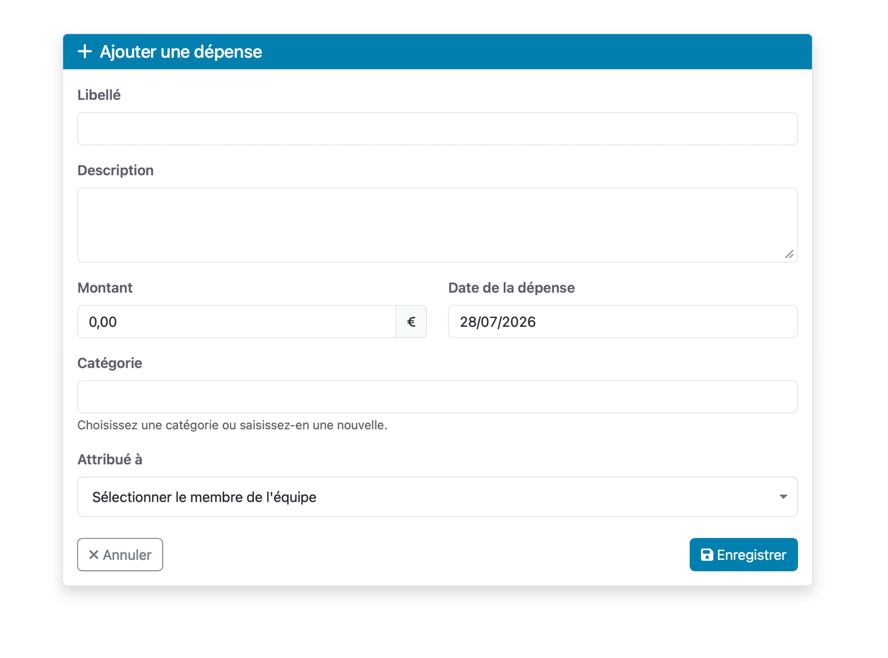
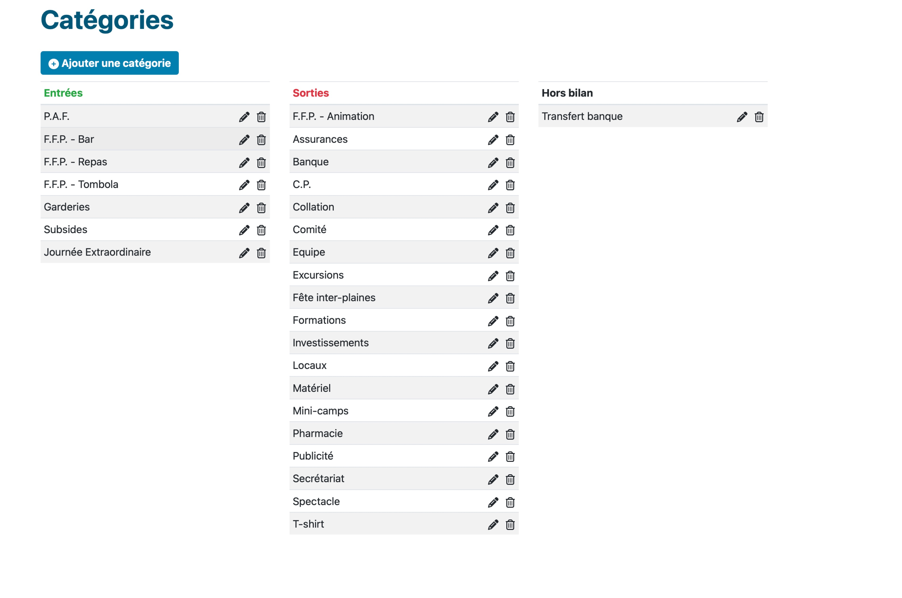
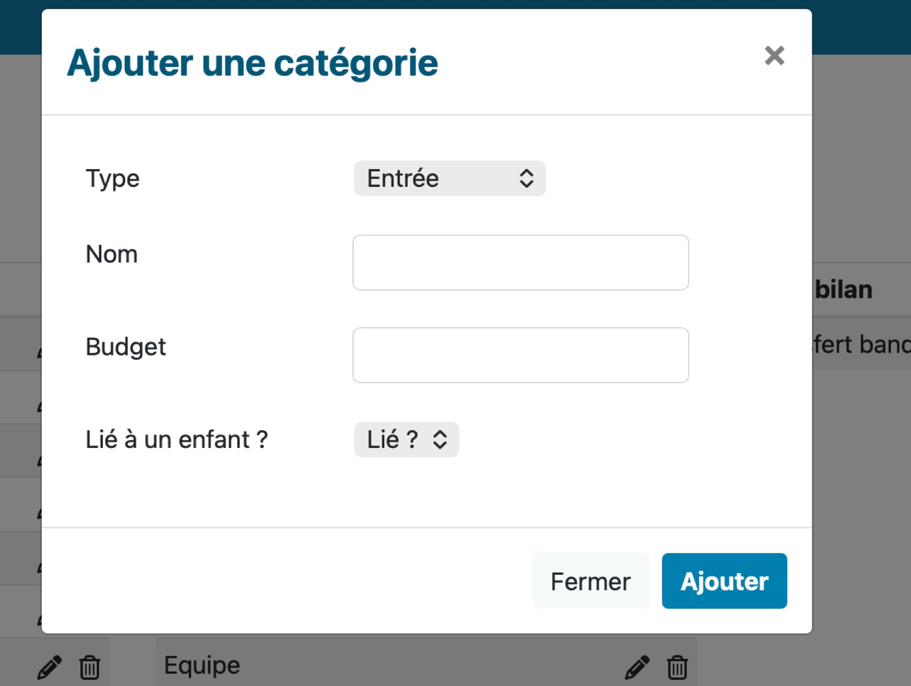
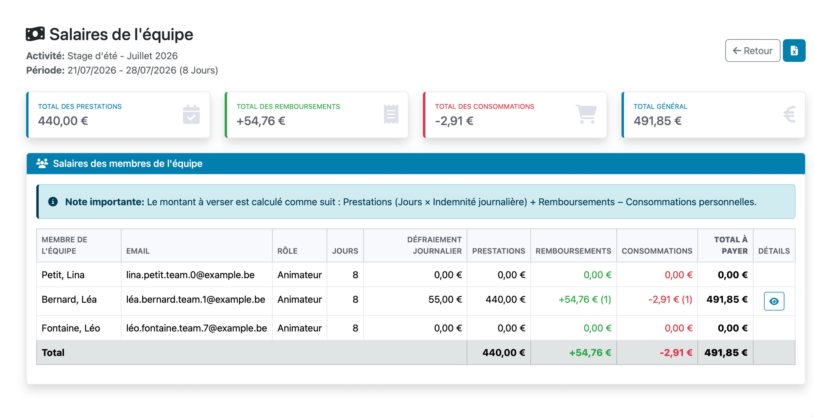

# Comptes

# Comptes

Là aussi, simplification au maximum.

Quand on clique sur COMPTE, on arrive sur la liste des transactions. On peut masquer les infos.

Juste la liste.

Au niveau du détail, ça peut juste être la catégorie. Rien de plus.

Par contre, pour chaque ligne, il nous fait un ID unqiue “Numéro de ticket” qui permet de classer les vrais tickets papier dans une farde avce un numérotation qui correspond à ce qui est encodé.

Il faudra que tu m’expliques le fonctionnement des + Ajouter un paiement et + Ajouter une dépense.

Pour moi qu’on ajoute un paiement ou une dépense doit être le même écran.

## Catégories

⬆️ Pour notre fonctionnement, je vois 2 grands types de catégories:

- Celles “Entrées” qui sont normalement en positif : PAF des parents, subsides, Garderies,… Tout ce qui “rapporte de l’argent”
- Celles “Sorties” c’est à dire celle où normalement, on dépense/perd de l’rgent : matériel, assurances, banque, collation,…

Donc, quand on crée les catégorie, on peut garder ce fonctionnement + rajouter le budget.

Au final, les comptes dans le BILAN, sont présentés en 2 grandes catégories:

- Entrées
- Sorties
- Et on a même créé un “Hors bilan” qui est par exemple un transfert de compte du compte à vue au compte épargne. Ca crée une ligne dans les comptes, mais ça n’impacte pas le bilan.

Et dans celles là, on retrouve les sous-catégories indiquées juste avant.

Quand on clique sur une sous-catégorie, on retrouve la liste des tickets lié à cette catégorie.

Exemple ⬇️ J’ai cliqué sur “FFP - Repas”, j’ai alors accès à la liste des entrées et sorties FFP-Repas. 

⬇️ la partie Salaire de l’équipe peut sortir de là pour retourner dans l’onglet équipe. Ca peut-être une catégorie “Sorties” qui peut s’appeler Equipe et qui est là d’office. Et qui se complète automatiquement au fur et à mesure de l’avancement du tableau équipe.
Tout comme les PAF, c’est une catégorie Enntrée qu ipeut être là et qui se calcule toute seule puisqu’on a les infos par ailleurs.

## Le rapport

Tel qu’il est affiché là, il n’est pas très lisble. Je préfère la vue en Entrées / Sorties comme ici plus haut.

