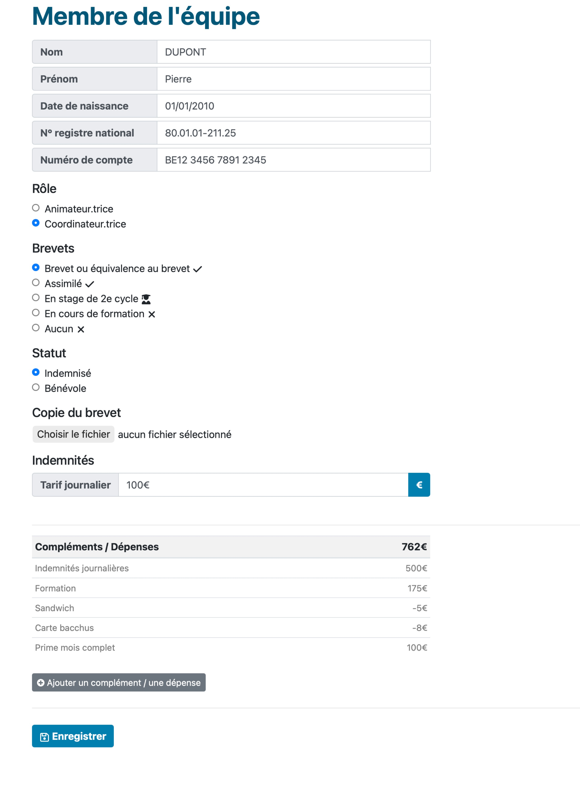

# Equipe

# Equipe

Cette vue, c’est TB. Mais je me demande comment pourrait-on l’alléger.

C’est bien de retrouver l’historique aussi…

En mettant en dessous ?

## Présence de l’équipe

Comme pour les enfants, on doit prévoir des présences de l’équipe au jour le jour, que le coordinateur doit cocher.

Exemple ci-dessous

Pour chacun, en cliquant sur son nom, on arrive dans le détail qu’on peut modifier.

Mais surtout, dans le bas, on a les complémentes / dépenses qu’on peut lui payer ou qu’il doit nous payer :

- formation
- sandwich
- prime
- …

On peut même mettre là son extrait de casier judiciaire

Et quelque part, on affiche le décompte pour tout le monde : le total à payer par personne. Pour celui qui fait les paiements, tout est rassemblé là.

