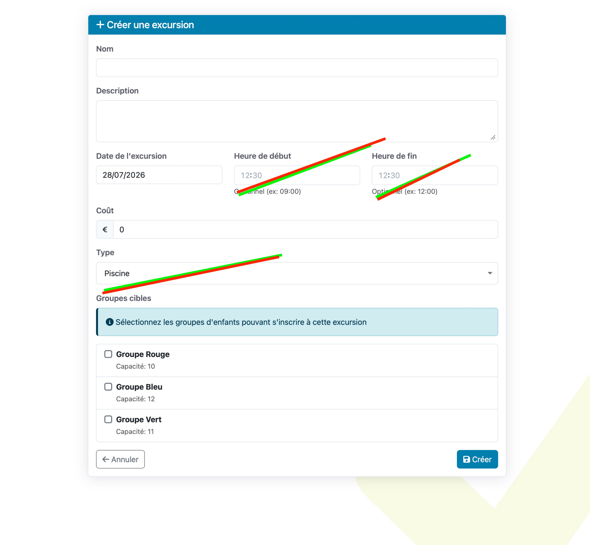
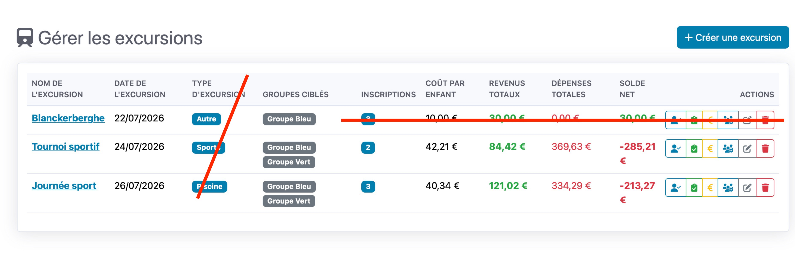

# Excursions

# Excursions

Dans gérer les excursions, on peut ne garder que le minimal minimal : Titre, date et groupe.

Ne l’efface pas à tout jamais, on va introduire ça 

Ce qui serait bien, c’est que quand une activité est programmée, le système nous propose d’envoyer un email “excursion”. On pourrait imaginer un modèle de mail pour ça. Que le coordinateur peut modifier mais déjà avec la date, le lieu, le montant,… et un lien de paiement personnalisé…