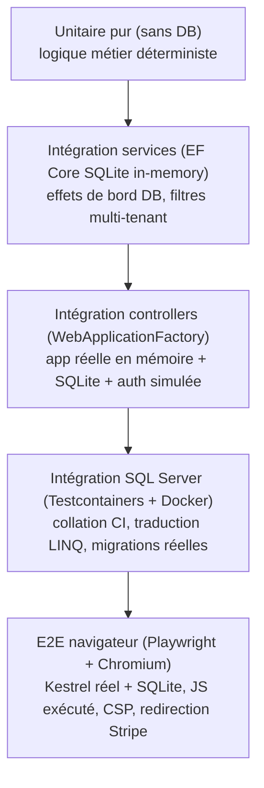

# Stratégie de test

Cedeva compte **~1130 tests** répartis sur **5 niveaux**, exécutés par **3 projets de test** et
**3 workflows CI**. Couverture lignes ≈ **89 %** (branches ≈ 76 %, méthodes ≈ 95 %), avec un **gate
CI à 85 %** qui bloque le déploiement en cas de régression. Ce document décrit ce que couvre chaque
niveau, l'infrastructure, les conventions et les pièges appris — pour maintenir la discipline quand
de nouvelles fonctionnalités arrivent.

## Pyramide



Base large d'unitaires rapides ; au-dessus l'intégration de bout en bout ; au sommet, deux niveaux
de **haute fidélité** (vrai SQL Server, vrai navigateur) plus lents, isolés dans des workflows CI
dédiés qui **ne bloquent pas** le déploiement.

## Projets de test

| Projet | Niveaux | Exécution | CI |
|--------|---------|-----------|----|
| `tests/Cedeva.Tests` | 1-3 (unitaire, intégration services SQLite, intégration controllers WAF) | rapide, aucune dépendance externe | **bloque le déploiement** (+ gate de couverture 85 %) |
| `tests/Cedeva.Tests.Sql` | 4 (SQL Server réel via Testcontainers) | nécessite Docker | workflow dédié `integration-sql.yml` |
| `tests/Cedeva.Tests.E2E` | 5 (navigateur via Playwright) | nécessite les navigateurs Playwright | workflow dédié `e2e-tests.yml` |

## Niveaux

### 1. Tests unitaires purs (sans DB)
- **Cible :** logique déterministe sans dépendance d'infra.
- **Exemples :** `StructuredCommunicationService` (mod-97 belge), `FinancialCalculationService`,
  `EmailVariableReplacementService`, `NationalRegisterNumberHelper` (clé de contrôle mod-97),
  `ValidNationalRegisterNumberAttribute`, validations DataAnnotations des ViewModels,
  `BookingPaymentService`, `StripePaymentGateway` (parsing webhook), `CurrentUserService`,
  `SessionStateService`/`SessionExtensions`, `ControllerExtensions`, services d'export Excel/PDF.
- **Outils :** xUnit + FluentAssertions (6.12.2) + NSubstitute. Culture figée en Invariant là où le
  formatage en dépend.

### 2. Tests d'intégration services (EF Core SQLite in-memory)
- **Cible :** services dépendant du `DbContext` et effets de bord persistés.
- **Exemples :** `ExcursionService`, `ExcursionViewModelBuilderService`, `BookingQuestionService`,
  `EmailTemplateService`, `BelgianMunicipalityService`, `UnitOfWork`, `UserDisplayService`,
  **filtres multi-tenant** (coordinateur = sa seule org, admin = tout, `IgnoreQueryFilters` bypass).
- **Infra (`tests/Cedeva.Tests/TestSupport/`) :** `SqliteTestContext` (connexion in-memory ouverte,
  `EnsureCreated`, `NewContext` pour vérifier l'état persisté), `FakeCurrentUserService`
  (Admin/Coordinator), `TestData` (builders de graphes d'entités valides).
- ⚠️ Le `DbContext` exige un `ICurrentUserService` non-null (les filtres le déréférencent) → la
  factory en fournit toujours un (admin par défaut).

### 3. Tests d'intégration controllers (WebApplicationFactory)
- **Cible :** la vraie app (pipeline, routing, auth, vues, JSON) de bout en bout — succès, **données
  invalides**, **accès non autorisé** (401), **isolation multi-tenant** (404 cross-org), cas limites.
- **Couverture :** tous les contrôleurs (Activities, Bookings, Children, Parents, TeamMembers,
  Organisations, Users, Account, ActivityGroups, ActivityQuestions, ActivityManagement, EmailTemplates,
  Financial, Payments, Excursions, OnlinePayment, PublicRegistration dont le **flux multi-étapes**,
  Home, AddressApi).
- **Infra :** `CedevaWebApplicationFactory` — démarre l'app réelle, remplace SQL Server par SQLite
  (connexion partagée), désactive le seeding (`RunStartupSeeding=false`), `TestAuthHandler`
  (header `X-Test-User = userId|orgId|role` → claims), `FakeAntiforgery` (POST sans token).
- ⚠️ Sérialisés (`[Collection("WebApp")]`, `DisableParallelization`) : plusieurs hôtes en parallèle
  se marchent dessus sur l'état statique (Serilog `Log`, HostFactoryResolver).

### 4. Tests d'intégration SQL Server (Testcontainers)
- **Cible :** le comportement que SQLite **ne reproduit pas** — collation insensible à la casse
  (`CI_AS`), traduction LINQ→SQL, et application de la **chaîne de migrations réelle**.
- **Infra :** `SqlServerFixture` démarre un conteneur **SQL Server 2022** (image `mssql/server:2022`)
  via `Testcontainers.MsSql`, applique le schéma avec `MigrateAsync()` (pas `EnsureCreated`, pour
  matcher exactement la prod), expose un `CedevaDbContext`.
- **Exemples :** recherche/validation de communes insensibles à la casse.
- ⚠️ Nécessite Docker (présent sur `ubuntu-latest` en CI). Plus lent → workflow dédié.

### 5. Tests E2E navigateur (Playwright)
- **Cible :** la classe de régressions invisible aux tests HTTP — **CSP qui bloque les scripts**,
  JavaScript qui ne s'exécute pas, autocomplétion, validation jQuery, rendu de l'iframe, redirection
  vers Stripe Checkout.
- **Infra :** `PlaywrightAppFactory` démarre l'app sur **Kestrel réel** (port aléatoire, http — pour
  que `UseHttpsRedirection` devienne un no-op) avec SQLite, pilotée par **Chromium headless**.
  `TestAuthHandler` par header permet d'exercer les pages admin tout en gardant le flux public anonyme.
- **Exemples :** chargement de l'iframe d'inscription (jQuery chargé, aucune violation CSP),
  inscription complète anonyme → page de confirmation, rejet d'un NRN invalide, autocomplétion adresse.
- ⚠️ Installer les navigateurs : `pwsh tests/Cedeva.Tests.E2E/bin/<cfg>/net10.0/playwright.ps1 install chromium`
  (sous Windows sans `pwsh`, utiliser Windows PowerShell : `powershell -File ...`).

## Lancer les tests

```bash
# Rapides (bloquent le déploiement) + couverture
dotnet test tests/Cedeva.Tests -c Debug

# SQL Server réel (Docker requis)
dotnet test tests/Cedeva.Tests.Sql

# E2E navigateur (après installation des navigateurs Playwright)
dotnet test tests/Cedeva.Tests.E2E
```

## Conventions
- Nom de classe `…Tests` ; méthodes en `Méthode_Condition_RésultatAttendu`. Arrange / Act / Assert.
- Chaque test d'intégration a sa propre base (isolation), seedée via `TestData`.
- Choix du niveau : logique métier → unitaire ; touche la DB → SQLite ; flux HTTP/auth/vue →
  WebApplicationFactory ; spécificité SQL Server (collation/traduction) → Testcontainers ;
  comportement navigateur (JS/CSP/iframe) → Playwright.

## Pièges d'écriture de tests appris
- **Isolation multi-tenant transitive :** les filtres se propagent à travers les **navigations
  requises**. Une action qui `.Include()` une entité filtrée (ex. `ActivityQuestions` → `Activity`)
  renvoie vide/404 pour un coordinateur dont l'org ≠ celle de l'entité → donner au client de test
  l'**org seedée** pour les chemins « succès ».
- **Collisions de marqueurs :** des mots d'entités (« Enfant ») apparaissent dans le **menu de
  navigation** (« Enfants ») → asserter sur un marqueur **unique** seedé (ex. un nom d'activité
  dédié), pas sur un nom d'enfant.
- **Encodage HTML :** apostrophes/accents (« Chloé », « Camp d'été ») sont encodés dans les vues →
  utiliser des marqueurs ASCII.
- **Model binding :** une propriété `Id` de type complexe se lie depuis la **route** → un « mismatch »
  route vs modèle est inatteignable via HTTP. `RedirectToAction(Index)` → `Location` = `/<Controller>`
  (sans « Index »).
- **FindAsync contourne les filtres** de requête (utiliser `IgnoreQueryFilters().FirstOrDefaultAsync`
  quand on veut bypasser explicitement, ou un `FirstOrDefaultAsync` filtré quand on veut l'isolation).

## Gate CI & couverture
- Le workflow de déploiement exécute `dotnet test tests/Cedeva.Tests` **avant le déploiement** avec un
  **gate de couverture** : ligne totale **≥ 85 %** (réel ≈ 89 %), migrations et vues Razor générées
  exclues. Une suite rouge ou une couverture sous le seuil bloque la mise en prod.
- Le seuil est un **cliquet** : on le remonte au fil du temps (12 % → 40 % → 75 % → 85 %).
- Les workflows E2E et SQL Server tournent en parallèle mais **ne bloquent pas** le déploiement
  (signal de qualité, pas barrière).

## Bugs réels trouvés par les tests (et corrigés)
La montée en couverture a fait émerger plusieurs anomalies, toutes corrigées :
- CSP bloquant jQuery/validation/autocomplétion (cdnjs absent de `script-src`).
- Requêtes EF non traduisibles (`ToLowerInvariant` / `Contains(StringComparison)`) cassant
  l'autocomplétion d'adresse et toutes les recherches/exports.
- Iframe d'inscription en 404 pour les visiteurs anonymes (filtre tenant sur le flux public).
- Export Bookings (Excel/PDF) en 500 (repository en mémoire + `ToListAsync`).
- Fuites multi-tenant (Bookings `Details/Edit/Delete`, `ActivityManagement` stats).
- `TeamMembers` `DeleteLicense` en 500 (colonne `LicenseUrl` requise mise à `null`).
- FK `Expense → Activity` en `SET NULL` sur colonne non-nullable.

## Hors périmètre / exclusions
- **CODA & rapprochement bancaire** : fonctionnalité **supprimée** (remplacée par le paiement en
  ligne Stripe — voir [ADR 0010](adr/0010-online-payments-provider-agnostic-stripe.md)).
- Intégrations externes réelles (Azure Blob Storage, envoi réseau réel Brevo) : mockées, pas appelées.
- Traductions NL/EN (placeholders).
