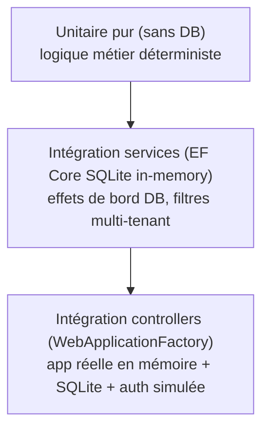

# Stratégie de test

Cedeva compte **95 tests** (xUnit) répartis sur 3 niveaux. Ce document décrit ce que couvre chaque
niveau, les conventions, l'infrastructure de test et le gate CI — pour que la discipline se maintienne
quand de nouvelles fonctionnalités arrivent.

## Pyramide

Base large d'unitaires rapides, sommet plus fin d'intégration de bout en bout.

## Niveaux

### 1. Tests unitaires purs (sans DB)
- **Cible :** logique déterministe sans dépendance d'infra.
- **Exemples :** `StructuredCommunicationService` (mod-97 belge), `FinancialCalculationService`
  (revenus, dépenses, formule salaire, net), `EmailVariableReplacementService` (22 variables, chaînes
  nulles), `NationalRegisterNumberHelper`.
- **Outils :** xUnit + FluentAssertions. Culture figée en Invariant là où le formatage en dépend.

### 2. Tests d'intégration services (EF Core SQLite in-memory)
- **Cible :** services dépendant du `DbContext` et effets de bord persistés.
- **Exemples :** `ExcursionService` (inscription → `TotalAmount` += coût, recalcul `PaymentStatus`,
  transaction financière ; désinscription ; résumé), `BookingQuestionService`, **filtres multi-tenant**
  (coordinateur = sa seule org, admin = tout, `IgnoreQueryFilters` bypass), `EmailRecipientService`.
- **Infra :** `SqliteTestContext` (connexion in-memory maintenue ouverte, `EnsureCreated`, `NewContext`
  pour vérifier l'état persisté), `FakeCurrentUserService` (Admin/Coordinator), `TestData` (builders de
  graphes d'entités valides). Voir `tests/Cedeva.Tests/TestSupport/`.
- ⚠️ Le `DbContext` exige un `ICurrentUserService` non-null (filtres) → la factory en fournit toujours un (admin par défaut).

### 3. Tests d'intégration controllers (WebApplicationFactory)
- **Cible :** la vraie app (pipeline, routing, auth, vues, JSON) de bout en bout.
- **Exemples :** Bookings (endpoints JSON + challenge 401), Excursions (`RegisterChild`/`Unregister`/
  `UpdateAttendance` POST → effets DB), Financial (redirect, rendu du dashboard, **404 cross-org**),
  Payments, `/health` + en-têtes de sécurité, rate limiting (429).
- **Infra :** `CedevaWebApplicationFactory` — démarre l'app réelle, remplace SQL Server par SQLite,
  désactive le seeding (`RunStartupSeeding=false`), `TestAuthHandler` (header `X-Test-User` =
  `userId|orgId|role` → claims), `FakeAntiforgery` (POST sans token).
- ⚠️ Ces tests sont **sérialisés** (`[Collection("WebApp")]`, `DisableParallelization`) : plusieurs hôtes
  en parallèle se marchent dessus sur l'état statique (Serilog `Log`, HostFactoryResolver).

## Conventions
- Nom de classe `…Tests` ; méthodes en `Méthode_Condition_RésultatAttendu`.
- Arrange / Act / Assert ; assertions FluentAssertions.
- Chaque test d'intégration a sa propre base SQLite (isolation), seedée via `TestData`.
- Pour un nouveau service à logique métier → test unitaire ; s'il touche la DB → test SQLite ; pour un
  flux HTTP/auth/vue → test WebApplicationFactory.

## Gate CI & couverture
- Le workflow exécute `dotnet test` **avant le déploiement** : une suite rouge bloque la mise en prod.
- `coverlet.collector` est référencé. **Intention** : viser une couverture élevée sur la logique métier
  (services), tolérer plus bas sur l'infra/config. *Le gate de couverture chiffré reste au backlog.*

## Hors périmètre / exclusions
- **CODA & rapprochement bancaire** : fonctionnalité vouée à la suppression → non testée
  (`CodaParserService`, `BankReconciliationService`).
- Traductions NL/EN (placeholders), vues détaillées de rendu (testées au niveau « la page répond 200 »).
